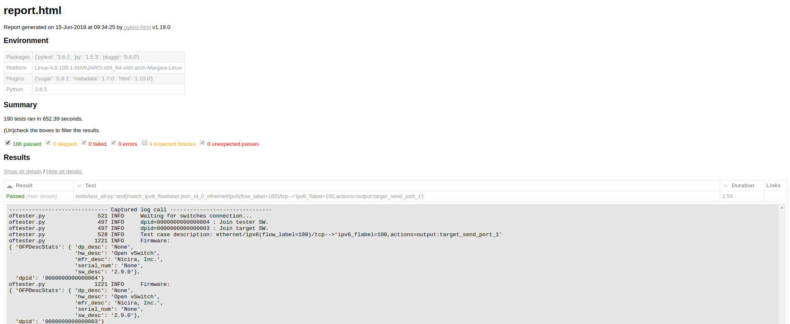

## pragmaticflows

`pragmaticflows` is being used at [AmLight](https://www.amlight.net) to assess the conformance of OpenFlow version 1.3 on certain switch platforms focused on use cases for production networks pragmatically. `pragmaticflows` is a Ryu application which was forked from the classic [Ryu test suites](https://github.com/osrg/ryu/tree/master/ryu/tests/switch/of13).

## Enhancements

- Fully integrated with pytest for first-class test cases selection and HTML reports. You can select or troubleshoot/debug each test case individually thanks to pytest.
- All test cases written in json files have been refactored with actual variables so you can use with any OF1.3 switches regardless of their port numbers.
- Flowmods, PacketIns, PacketOuts and Errors are all logged to simplify the analysis, so just by analyzing the report you'll be able to figure out what happened.
- Removed miss tables checks, packet-ins are checked in instead, to reduce false positives.
- Removed all MPLS and PBB packets that were in several use cases since most vendors don't actually support these features.

### Report

Here's a screenshot of the report that you should expect when you run `pragmaticflows` with the `--html-report.html --self-contained-html` options:



## Topology

- You'll need at least two links between the two OpenFlow switches. A third link is only necessary for advanced other more elaborated features such as multicast groups and QoS metering, which is not implemented yet on pragmaticflows yet.
- Also, you'll need a controller running ryu to control these

```
------------------
    (1) -- (1)
 s1 (2) -- (2) s2
------------------
```

- `s1` and `s2` represent an OpenFlow 1.3 switch.
- The numbers `(1)` and `(2)` in the topology are the `of_port` numbers.

## Pre-requisites

Before running any test cases:

1. Make sure there aren't any type of unexpected network packets being sent on the interfaces being tested. This Ryu application relies on OpenFlow stats/counters/PacketIns/PacketOuts, so this is critical. For example, disable spanning tree, lldp and other L2 multicast protocols. Ideally, you should run a sniffer on these interfaces for a few minutes before starting to verify this point.
2. Install Ryu, either `pip install requirements.txt` on a virtualenv or `docker-compose up` if you want run Ryu on Docker.
3. Figure out which test cases you want to run.
4. Figure out all the OpenFlow interface numbers on the `tester` (auxiliary switch) and `target` (device under test), and their datapath ids you'll need to pass them to ryu-manager.
5. Read [Ryu Official Test Tool](http://https://osrg.github.io/ryu-book/en/html/switch_test_tool.html#reference-transfer-path-of-the-applied-packet) page to understand how validation packets will be sent over these three links in the topology.

## Test Suites

TODO

## Test Selection

TODO
